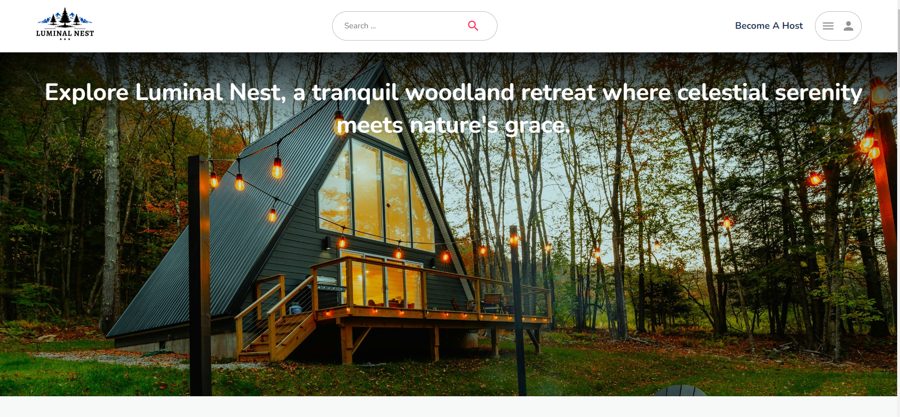
# Luminal Nest

## Description
Luminal Nest is a dynamic rental website offering a diverse selection of homes, rooms, and lodges in top travel destinations. Leveraging cutting-edge technologies such as HTML5, React JS, Redux, and JWT for security. Powered by Node JS for server-side scripting and MongoDB for efficient data management, Luminal Nest delivers fast and reliable performance, allowing users to browse and book accommodations with ease. With SCSS for styling and Material UI for visual appeal, the website offers a sleek and intuitive interface that enhances the user experience.

## Features
- ### Explore Diverse Stays
  Browse through a curated selection of accommodations, ranging from rustic cabins nestled in the woods to modern apartments in bustling city centers.
- ### Easy Booking
  Our user-friendly booking system allows you to effortlessly reserve your preferred stay with just a few clicks, ensuring a hassle-free booking experience.
- ### Host Management
  Become a host and add your listings to Luminal Nest, manage your properties, and track reservations with ease. Hosts can access reservation lists to keep track of bookings for their properties.
- ### Additional Pages
  Explore various pages such as trip lists, wish lists, property lists, and reservation lists, providing a comprehensive platform for managing your travel plans and accommodations.

## Local Development
Luminal Nest has been successfully developed and tested locally. It has not been deployed to any production environment yet.

## Screenshots
Screenshots of the Luminal Nest website will be added here to showcase its features and user interface.

- ## Home page:
  The website features a logo positioned at the top left corner across all pages. Clicking on the logo redirects users to the home page, ensuring consistent and easy navigation throughout the website. 
The Navbar provides intuitive navigation along with search functionality and a dynamic dropdown menu. Initially presenting login and sign-up options, upon user authentication, it showcases the user's profile picture and grants access to trip lists, wish lists, property lists, reservation lists, and host functionalities for a seamless browsing experience. Additionally, a "Become a Host" link enables users to post their places as listings, with access to the reservation list to monitor bookings.

  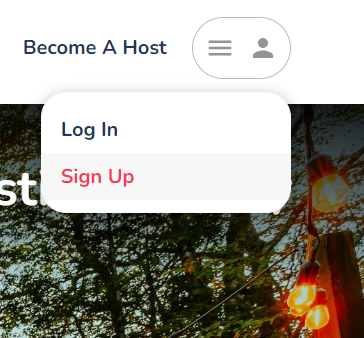
  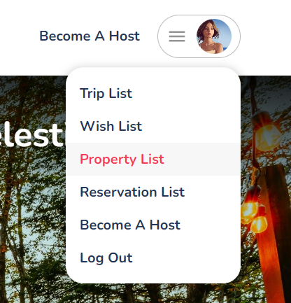

- ## Home page's explore top categories section:
  On scrolling down the home page, expect an engaging user experience enriched with captivating visuals and interactive elements. As you hover over each category icon, anticipate a delightful animation or effect that enhances the browsing journey. 

 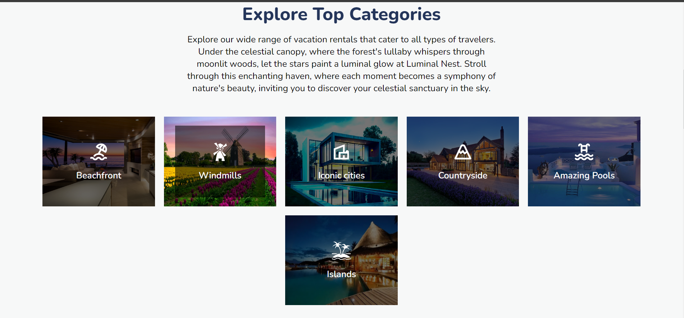

- ## Home page's listings section:
  As users scroll down the home page, Luminal Nest presents a dynamic array of listings categorized by type. Leveraging React components and Redux state management, this section allows seamless exploration of accommodations with features like wishlisting and interactive slide navigation.

 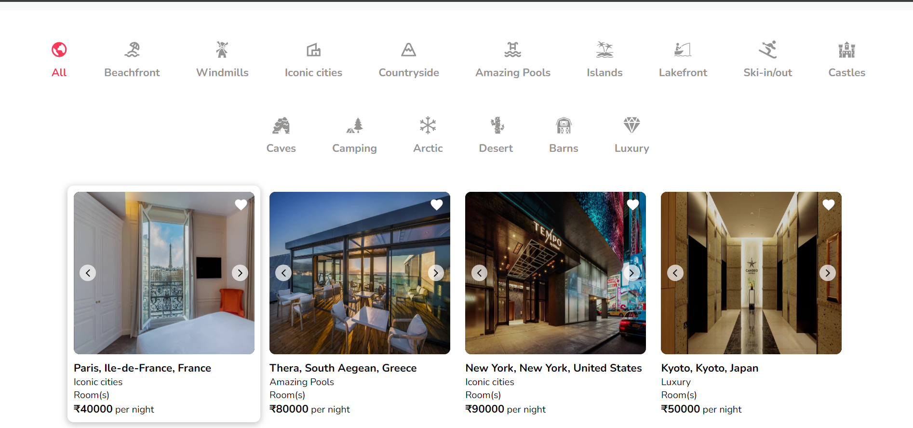

 As shown in the above screenshot, the Listings component offers users a comprehensive view of listings spanning all categories. With the ability to filter by specific categories like beachfront, windmills, iconic cities, and more, users can easily explore listings tailored to their preferences.

 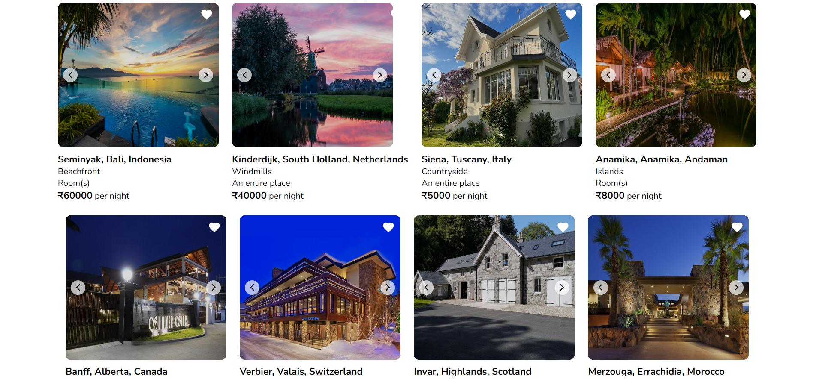

- ## Home page's footer section:
  Footer encompasses an "About Us" section providing insights into the platform's ethos, alongside a contact section featuring essential contact details, including phone number and email address.

  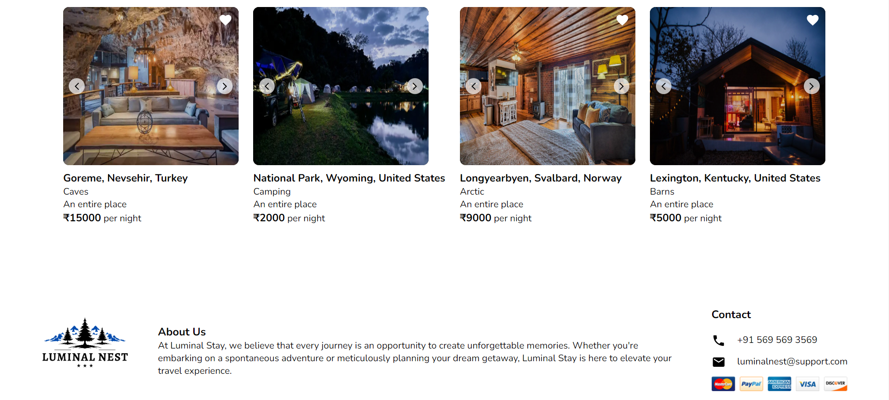

- ## Sign Up page:
  The sign-up page provides users with a form to create a new account, allowing them to enter their personal details including name, email, and password, and upload a profile photo. Upon submission, the user is directed to the login page.

  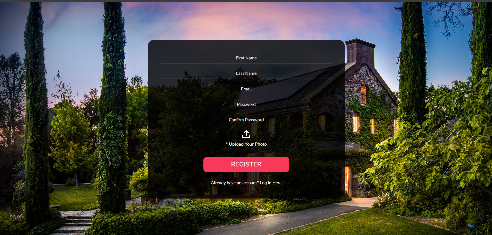

- ## Login page:
  The login page presents users with a form to enter their email and password for authentication. Upon submission, the user's credentials are verified through a server request. If successful, the user is logged in and redirected to the home page. Additionally, users have the option to navigate to the registration page if they do not have an account.

  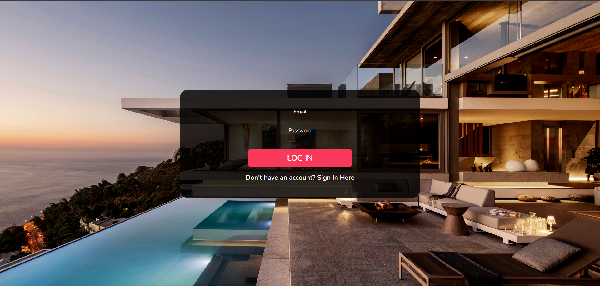

- ## Create listing page:
  This page provides users with a robust platform to publish their properties efficiently. Through structured form fields, users can input detailed information about their place, including categories, location specifics, basic counts, amenities, and compelling photos. This technical interface ensures a systematic approach to listing creation, enhancing user experience by guiding them through each step seamlessly. Upon submission, the data is processed and stored, enabling users to showcase their property effectively on the platform.

  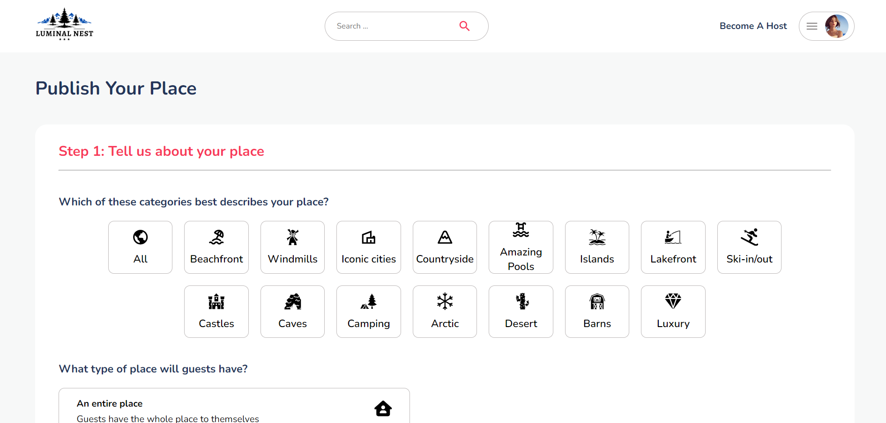
  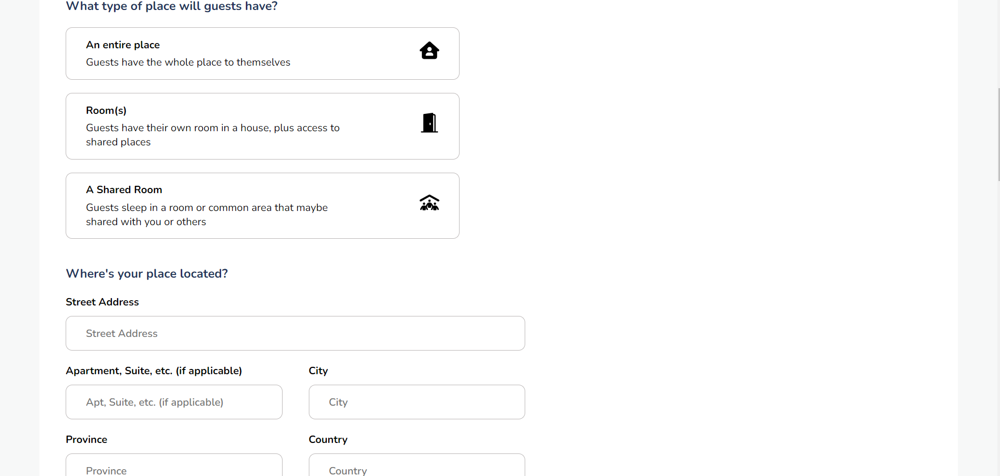

  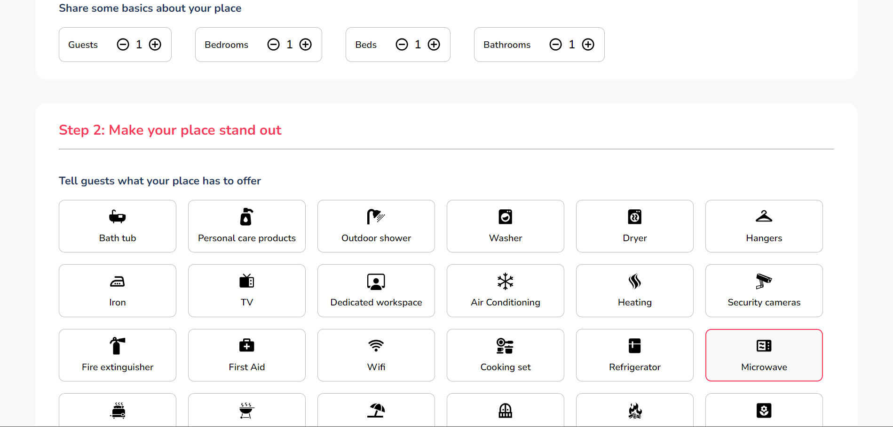
  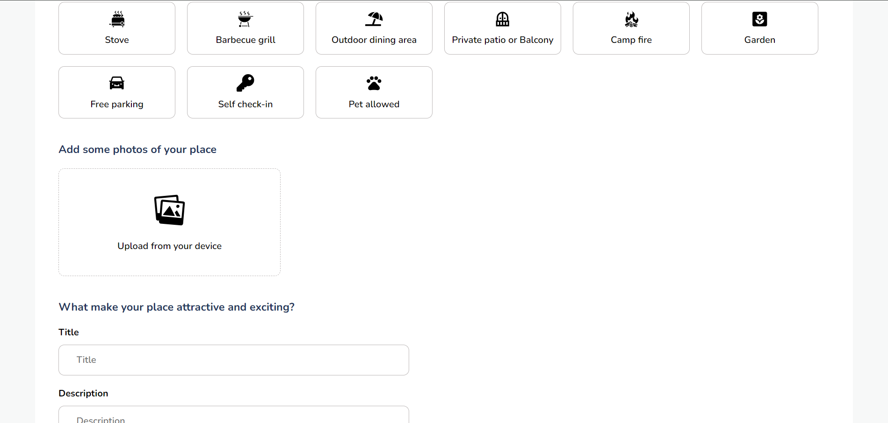

  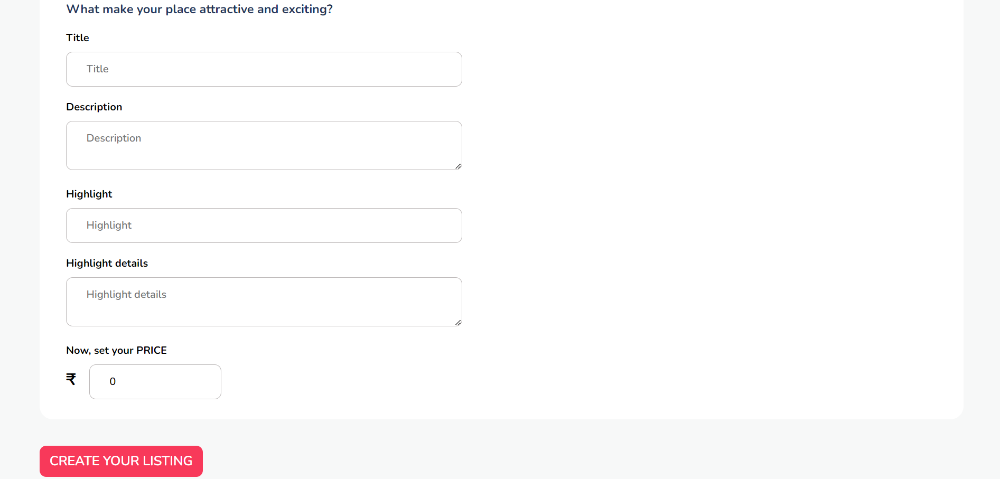

Upon successful completion of the listing creation process, users are redirected to the home page, where they can instantly view their newly listed property displayed as a card within the listings. This seamless transition ensures immediate visibility and accessibility of the newly added listing, enhancing the user's experience on the platform.

- ## Properties page:
  The Properties page, represented by ListingDetails.jsx, retrieves and displays detailed information about a specific property. Utilizing React Router and useParams, it dynamically fetches data for the designated property based on the provided listing ID. The page presents various details including property title, description, location, amenities, and booking functionality. Additionally, it allows users to select dates for booking through a calendar component and calculates the total price based on the selected duration. The server-side model, booking.js, defines the MongoDB schema for bookings, ensuring the structured storage and retrieval of booking-related data such as customer ID, host ID, listing ID, booking duration, and total price.

  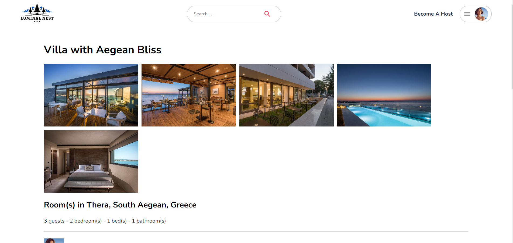

  

    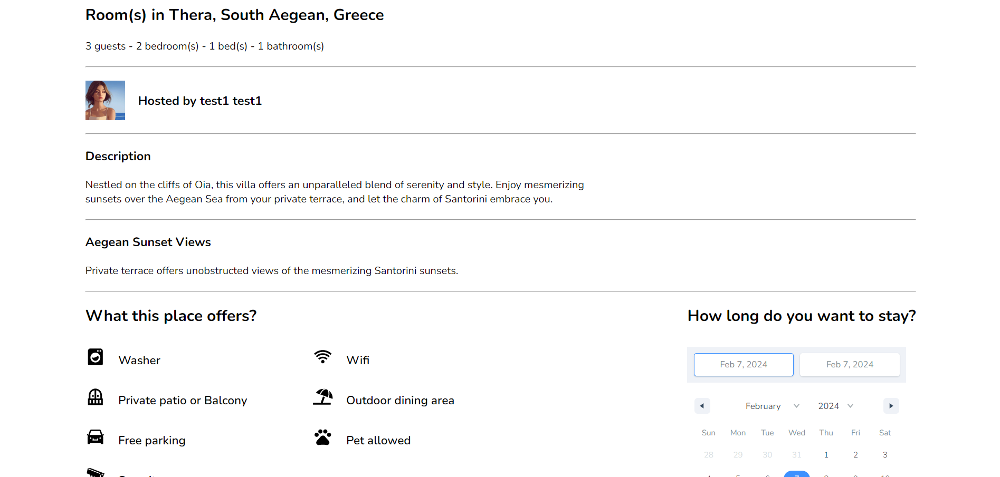
    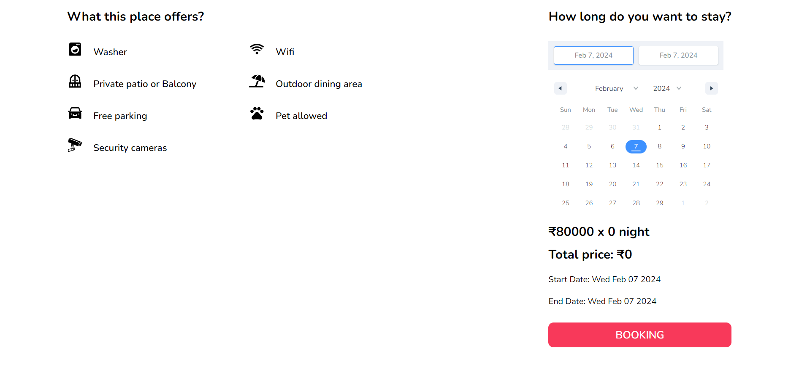
  

In addition to all these pages, the website features additional pages including trip lists, wish lists, property lists, and reservation lists.

- ## Tech stack:
  Built a dynamic rental platform using HTML5, React JS, Redux, and JWT for security, coupled with Node JS, MongoDB, SCSS, and Material UI for efficiency and visual appeal.
